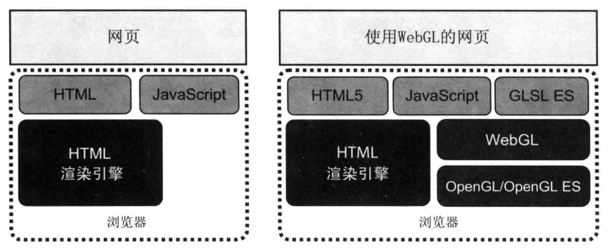
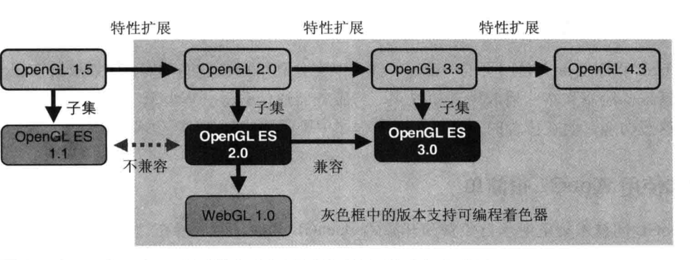
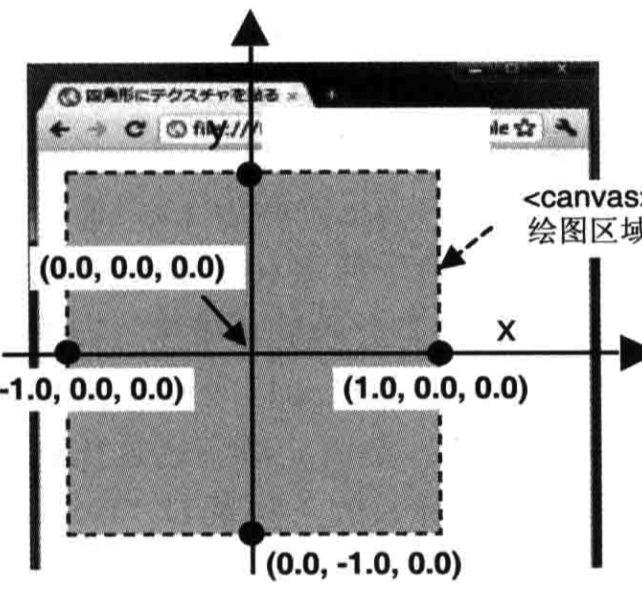
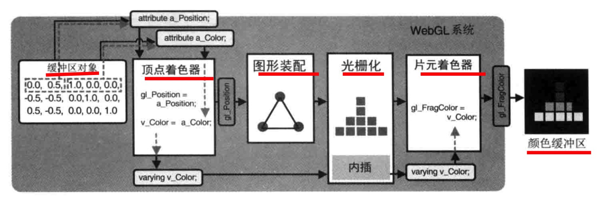
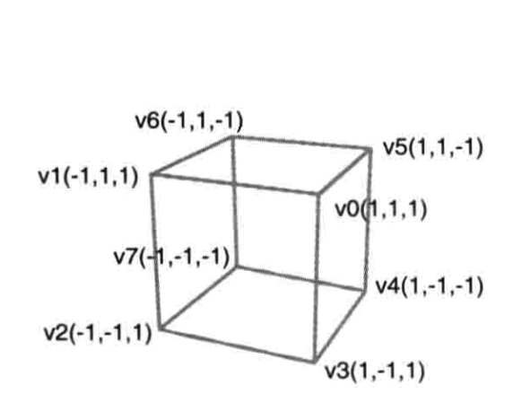

# WebGL 入门到放弃

WebGL(Web Graphics Library)是在浏览器中渲染3D图形，并可与之交互的技术。

* WebGL实现
* svg vs canvas vs WebGL
* 一个简单的例子: 点
* 再来一个例子: 彩色三角形
* 一个复杂的例子: 立方体
* 为何放弃
* 相关的类库和参考资料

---

## WebGL的实现

---

---
## svg & canvas & WebGL
|            | svg                    | canvas             | webgl        |
| ---------- | ---------------------- | ------------------ | ------------ |
| 2d/3d      | 2d                     | 2d                 | 2d + 3d      |
| 交互便捷 | ✨✨✨                    | ✨✨                 | ✨            |
| 开发难度   | ✨                      | ✨✨                 | ✨✨✨          |
| 失真       | 不失真                 | 失真               | 失真         |
| 引用图片   | x                      | √                  | √            |
| 适合场景   | 数据较少, icon, 高保真 | 数据较多, 复杂场景 | 3D, 复杂场景 |

<!-- 
  svg例子 https://codepen.io/arcticben/pen/zZaRqQ
  canvas例子 https://codepen.io/arcticben/pen/OWYyeo
-->

---
## 一个简单的例子: 点

查看代码: `HelloPoint.html`

### 套路
1. 定义着色器
2. 绑定数据
3. 绑定交互事件

--- 
## WebGL中的一些概念

### 着色器
  顶点着色器：描述点的特性, 大小和位置
  片元着色器：逐个片元(像素)处理, 颜色

<!--
  要使用webgl必须使用着色器, 在js中以字符串的形式声明
  着色器有两种
  实际是一种叫做glsl es的语言
-->

---

### 坐标系

<!-- 
  canvas中坐标系是二维的, 左上角为(0,0)
  WebGL中的坐标系是三维的, 坐标原点在中间. 右手坐标系
-->

---
## 再来一个例子: 彩色三角形 

查看代码: `ColorTriangle.html`

---
## 颜色

--- 
## 一个复杂的例子

`HelloCube.html`

---

## 为何放弃
`ThreejsCube.html`

**开发效率**

---

## 相关的类库和参考资料

- three.js
- deck.gl
- babylon.js
- [so on](https://gist.github.com/dmnsgn/76878ba6903cf15789b712464875cfdc)

webgl编程指南
mdn文档